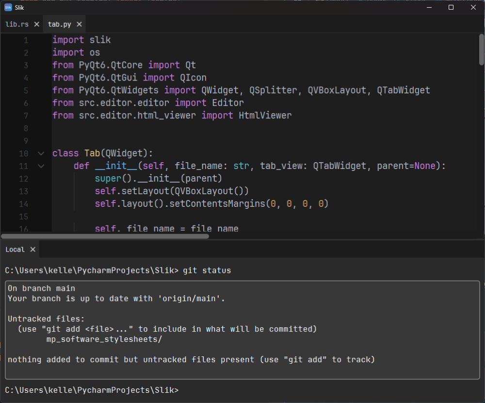

# Slik
Slik is the official IDE for MP Software developers.

## Overview
Slik is based on three key points:

1. Fully Automatic: 
> Slik will detect virtual environments, main entrypoints, and index file system changes.

2. Optimized For Success
> Slik uses a GUI implemented in PyQt, with a Rust backend handling the majority of IDE related tasks.

3. Hidden Until You Need It
> Slik's user interface is task specific, with dialogs being activated by key strokes _(try `Ctrl+Q` to see the file browser!)_

## Free And Open Source
Slik is 100% free with no drawbacks or limitations. There is no "premium" version; you get the latest and greatest,
all licensed under the GPL. Slik currently only supports Windows, but can be run on macOS and Linux by cloning this
repository.
