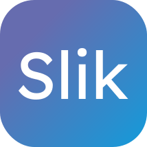

# Slik
> IDEs these days suck; they're too heavy, too slow, too complex - it divides developers. That's why we built Slik, to change the normal.

## Overview
Slik combines the best of all worlds with:

- **Creative UI** Slik's user interface is task specific, with all dialogs being activated by key strokes. This means code focus without the distraction of multiple widgets and windows.
- **No IDE directory** Slik doesn't need ".vscode" like directories for IDE specific features. This frees up project space and keeps your codebase clean.

## Free And Open Source
Slik is 100% free with no drawbacks or limitations. There is no "premium" version; you get the latest and greatest, 
all licensed under the GPL. Slik currently only supports Windows, but can be run on macOS and Linux by cloning this 
repository.
